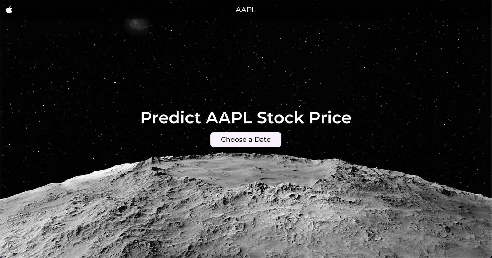

# 📈 AAPL Stock Price Predictor
Predict Apple stock prices from 2013 to 2025 using machine learning — with actual historical prices for comparison.

## 🚀 Features
- 🔮 Predict AAPL stock price for any date between **2013 – 2025**
- 📊 View both the **predicted** and **actual** closing price (if available)
- 📱 Frontend built with **Flutter (Web)**
- 🔌 Backend powered by **Flask API**
- 🧠 Trained on **10 years of data (2013–2023)**

## 🛠️ Tech Stack

- **Frontend**: Flutter + Dart (Web)
- **Backend**: Flask (Python)
- **ML & Data**:
  - `yfinance` (data fetching)
  - `pandas`, `numpy`, `scikit-learn`, etc.

## 🧠 ML Model

- Supervised regression model
- Trained on historical closing prices of AAPL
- Not optimized for real trading — just a learning project

## 📷 Demo


## 📦 How to Run
### Backend (Flask API)
```bash
pip install -r requirements.txt
python apple_predictor.py
```
### Frontend (Flutter Web App)
```bash
cd aapl_predictor
flutter pub get
flutter run -d chrome
```
**Make sure the Flask API is running locally before starting the frontend.**

### ⚠️ Disclaimer
This is a learning project only. Not intended for real-world trading or financial advice.

### 📬 Contact
Email - anantsinghal807@gmail.com

LinkedIn - [LinkedIn ](https://www.linkedin.com/in/anant-singhal-linkdn/)
